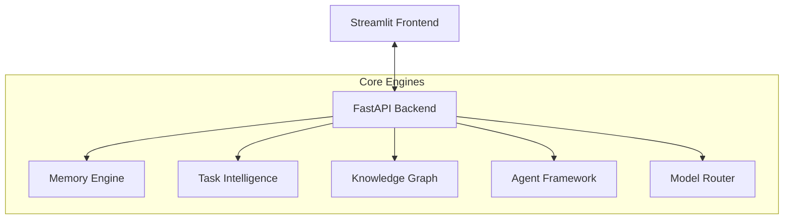

# OmniMind AI OS — AI Operating System


OmniMind AI OS is a production-ready AI Operating System that provides unified memory, multi-agent orchestration, RAG, a prompt studio, and observability for building reliable LLM-based applications.

Quick pitch
- One-line: Multi-agent, memory-enabled AI OS for building production RAG and automation workflows.
- Focus: memory vaults, task intelligence, observability, safe model routing, and deployable demos.

Live demo / Try it locally
- Demo: (add a public demo URL here when deployed)

Fast 1-minute quickstart (local)
1. Clone:
```bash
git clone https://github.com/mulugumanishkumar2006-del/omnimind-ai-os.git
cd omnimind-ai-os
```
2. Install:
```bash
python -m venv .venv
source .venv/bin/activate  # or .\.venv\Scripts\activate on Windows
pip install -r requirements.txt
```
3. Run (development):
```bash
python run.py
# FastAPI: http://127.0.0.1:8000
# Streamlit: http://127.0.0.1:8501
```

Docker (recommended for reproducibility)
```bash
docker compose up --build
```

Why this project matters
- Integrates production concerns (p95 latency, cost monitoring, hallucination detection) with developer ergonomics (prompt studio, model routing).
- Designed with fallback adapters so it runs locally without external APIs for development and testing.

What recruiters / reviewers should look for
- README quickstart & demo (this file)
- CI that runs regression tests and quality gates
- Architecture notes and reproducible deployment (Docker)

Technical architecture (high level)


Repository layout
- backend/      — FastAPI application & services
- frontend/     — Streamlit dashboard
- infra/        — Docker compose, deployment configs
- tests/        — Regression & quality gate suites

Next improvements I suggest (I can open PRs for these)
- Add a one-minute demo GIF and hosted public demo (Vercel/Render)
- Add GitHub Actions CI to run regression tests and quality gates
- Add CONTRIBUTING.md, LICENSE (MIT recommended), and CODE_OF_CONDUCT

Contact / Maintainer
- Mulugu Manish Kumar — https://github.com/mulugumanishkumar2006-del
- Email: mulugumanishkumar2006@gmail.com

License
- MIT (add LICENSE file if not present)
